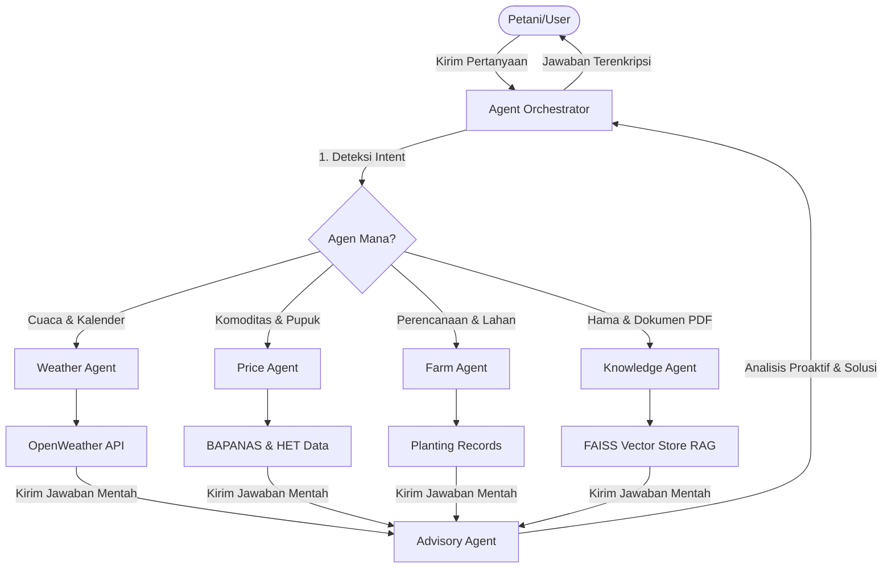

# Tani Cerdas AI Assistant 🌾🤖

Tani Cerdas adalah aplikasi asisten pertanian pintar berbasis kecerdasan buatan (AI) yang dirancang untuk membantu petani Indonesia dalam mengelola lahan, memantau cuaca lokal, mengecek harga pangan komoditas, mendeteksi hama, dan merencanakan aktivitas budidaya secara efisien. 

Proyek ini menggabungkan antarmuka modern yang responsif (React + Vite) dengan sistem backend tangguh (FastAPI) yang ditenagai oleh **Multi-Agent RAG (Retrieval-Augmented Generation)** baik secara offline penuh (LLM lokal) maupun cloud.

---

## 📌 Daftar Isi
1. [Fitur-Fitur Utama](#-fitur-fitur-utama)
2. [Penjelasan Mendalam Fitur Chatbot](#-penjelasan-mendalam-fitur-chatbot)
   - [Arsitektur Multi-Agent (Mode Agentic)](#arsitektur-multi-agent-mode-agentic)
   - [Spesialisasi 5 Agen Pertanian](#spesialisasi-5-agen-pertanian)
   - [Mode Legacy (Single-Agent ReAct)](#mode-legacy-single-agent-react)
   - [Mekanisme RAG & Integrasi Dokumen](#mekanisme-rag--integrasi-dokumen)
   - [Dukungan Suara (STT & TTS)](#dukungan-suara-stt--tts)
   - [Keamanan Data & Guardrails](#keamanan-data--guardrails)
3. [Teknologi, Framework, Library, & API](#-teknologi-framework-library--api)
4. [Panduan Instalasi & Menjalankan Program](#-panduan-instalasi--menjalankan-program)
   - [Prasyarat Sistem](#prasyarat-sistem)
   - [Langkah 1: Setup & Jalankan Ollama (Lokal)](#langkah-1-setup--jalankan-ollama-lokal)
   - [Langkah 2: Setup & Jalankan Backend (FastAPI)](#langkah-2-setup--jalankan-backend-fastapi)
   - [Langkah 3: Setup & Jalankan Frontend (React + Vite)](#langkah-3-setup--jalankan-frontend-react--vite)
   - [Menjalankan Frontend & Backend Bersamaan](#menjalankan-frontend--backend-bersamaan)
5. [Struktur Direktori Proyek](#-struktur-direktori-proyek)

---

## 🌟 Fitur-Fitur Utama

| Fitur | Deskripsi |
|---|---|
| **🌦️ Pemantauan Cuaca** | Prakiraan cuaca waktu-nyata (real-time) terintegrasi dengan OpenWeatherMap API berdasarkan lokasi profil petani. |
| **📚 Informasi & Panduan** | Pangkalan data internal yang menyajikan artikel panduan budidaya tanaman dan teknik pencegahan hama. |
| **💰 Pantau Harga Pangan** | Monitor harga bahan pokok nasional (BAPANAS) serta harga eceran tertinggi (HET) pupuk bersubsidi. |
| **👤 Profil Petani** | Kustomisasi asisten berbasis data profil petani (komoditas tanaman aktif, luas lahan, dan lokasi geografis). |
| **🎙️ Voice Assistant** | Navigasi halaman dan penginputan instruksi di aplikasi menggunakan suara asli Bahasa Indonesia. |
| **🔒 Enkripsi Data Keamanan** | Perlindungan data penting petani (riwayat chat, profil, dan catatan tani) menggunakan enkripsi tingkat tinggi (AES-128/256). |

---

## 💬 Penjelasan Mendalam Fitur Chatbot

Fitur chatbot Tani Cerdas bukan sekadar bot tanya-jawab biasa. Ini adalah asisten cerdas berbasis agen (**Agentic System**) yang dirancang untuk beroperasi secara mandiri maupun terkolaborasi demi menyelesaikan keluhan pertanian pengguna.

### Arsitektur Multi-Agent (Mode Agentic)
Sistem ini menggunakan pola desain multi-agent yang diatur oleh **`AgentOrchestrator`** (Orkestrator Utama). Ketika petani mengirimkan pertanyaan:
1. **Analisis Niat (Intent Classification)**: Orkestrator memindai masukan pengguna dan menentukan agen mana yang paling relevan berdasarkan kecocokan kata kunci (*keyword scoring*) atau klasifikasi LLM.
2. **Koordinasi Agen**: Orkestrator mengarahkan pertanyaan ke satu atau lebih agen spesialis secara paralel atau berurutan.
3. **Penggabungan Jawaban (Aggregation)**: Orkestrator merangkum respons dari agen utama dan menyempurnakannya dengan saran dari agen penasihat (*Advisory Agent*) sebelum dikembalikan ke antarmuka pengguna.



### Spesialisasi 5 Agen Pertanian
Aplikasi ini memiliki 5 agen cerdas yang memiliki peran masing-masing:
1. **Weather Agent (`weather`)**: Mengurus data iklim, kelembapan, suhu, dan memprediksi kecocokan hari menanam berdasarkan data BMKG / OpenWeatherMap.
2. **Price Agent (`price`)**: Mengawasi pergerakan harga komoditas (cabai, bawang, jagung, beras) dan menghitung estimasi biaya pupuk bersubsidi (Urea, NPK).
3. **Farm Agent (`farm`)**: Membantu merancang kalender budidaya tani, mencatat jadwal penyiraman/pemupukan, serta melacak luas lahan produktif petani.
4. **Knowledge Agent (`knowledge`)**: Agen pencari basis pengetahuan RAG. Bertanggung jawab membaca, memotong, dan mengekstrak informasi dari berkas PDF/Word panduan hama pertanian.
5. **Advisory Agent (`advisory`)**: Agen penasihat taktis. Menggunakan profil tani pengguna (contoh: Padi, lahan 1 ha, di Kediri) untuk memberikan saran bertani yang proaktif dan disesuaikan khusus untuk petani tersebut.

### Mode Legacy (Single-Agent ReAct)
Jika sistem dinonaktifkan dari mode agentic, asisten akan menggunakan mode *Legacy* berbasis **JSON-ReAct Loop** (Reasoning & Acting). Mode ini dioptimalkan khusus agar LLM lokal berukuran kecil (seperti Qwen 1.5B) dapat menggunakan alat (*tools*) secara mandiri melalui perintah JSON tanpa mengalami kegagalan *hallucination*.

### Mekanisme RAG & Integrasi Dokumen
Untuk menjawab pertanyaan teknis (misalnya: *"Bagaimana membasmi ulat grayak pada jagung?"*), chatbot menggunakan metode RAG:
* **Ingestion**: Membaca dokumen panduan dalam folder `backend/data/` (seperti PDF panduan hama dan dokumen Word budidaya).
* **Chunking**: Membagi dokumen menjadi bagian kecil (500 karakter dengan overlap 50) menggunakan `RecursiveCharacterTextSplitter`.
* **Embedding**: Mengubah teks menjadi representasi vektor menggunakan model lokal **`nomic-embed-text`** melalui Ollama.
* **Vector Store**: Menyimpan indeks vektor secara lokal dalam database **FAISS (Facebook AI Similarity Search)** untuk pencarian super cepat secara offline.

### Dukungan Suara (STT & TTS)
Aplikasi mendukung interaksi suara penuh demi mempermudah petani di lapangan:
* **Speech-to-Text (STT)**: Menggunakan Web Speech API (`SpeechRecognition` dengan konfigurasi bahasa `id-ID`) untuk menangkap suara pengguna dan mengonversinya menjadi teks di kolom chat secara akurat.
* **Text-to-Speech (TTS)**: Menggunakan `SpeechSynthesisUtterance` untuk membaca keras jawaban asisten AI dalam bahasa Indonesia yang natural, lengkap dengan tombol kendali audio (Volume/Stop) di bagian atas header chat.

### Keamanan Data & Guardrails
* **Data-at-Rest Security**: Data profil tani, riwayat obrolan, dan catatan penanaman dienkripsi menggunakan algoritma **AES (Fernet)** melalui pustaka `cryptography` Python sebelum disimpan ke dalam media penyimpanan JSON. Data hanya didekripsi oleh backend secara dinamis saat diminta oleh sesi pengguna yang sah.
* **Guardrails (Sistem Pagar Keamanan)**: Mencegah penyalahgunaan bot dengan memfilter input pengguna:
  1. *Deteksi Kata Kunci*: Memindai kata kunci pertanian/asisten umum (Fast path).
  2. *Deteksi Prompt Injection*: Memblokir perintah jahat seperti *"ignore system prompt"* atau percobaan injeksi kode Python.
  3. *LLM Classifier*: Jika kalimat ambigu, LLM akan menganalisis terlebih dahulu apakah topik pembicaraan relevan dengan ekosistem pertanian/cuaca/harga pangan sebelum memproses jawaban.

---

## 🛠️ Teknologi, Framework, Library, & API

Aplikasi Tani Cerdas dibangun menggunakan tumpukan teknologi modern berikut:

### Frontend (Antarmuka Pengguna)
* **React.js (v19)**: Library utama pembuatan UI komponen.
* **Vite**: Build tool dan dev server ultra cepat.
* **Axios**: Klien HTTP untuk berkomunikasi dengan API FastAPI backend.
* **Framer Motion**: Pustaka animasi untuk interaksi antarmuka yang dinamis dan premium.
* **Lucide React**: Set ikon modern yang ringan.

### Backend (Server & Logika AI)
* **FastAPI**: Framework web Python berkinerja tinggi untuk membangun REST API.
* **Uvicorn**: Server ASGI untuk menjalankan FastAPI.
* **LangChain & LangChain Community**: Framework orkestrasi LLM dan manajemen agen.
* **FAISS (faiss-cpu)**: Database vektor lokal untuk menyimpan indeks data RAG.
* **PyPDF & Docx2txt**: Pustaka ekstraksi teks dari file PDF dan Word.
* **Cryptography (v42)**: Pustaka enkripsi AES-Fernet untuk keamanan data.
* **Python-dotenv**: Pengelola file konfigurasi lingkungan `.env`.

### API & Layanan Eksternal yang Digunakan
1. **Ollama API (Lokal)**:
   * **`qwen2:1.5b` (atau `qwen2:2.5`)**: Model bahasa lokal (LLM) utama untuk memproses obrolan secara offline.
   * **`nomic-embed-text`**: Model embedding lokal untuk representasi vektor dokumen RAG.
2. **GitHub Models / Azure Inference API (Cloud)**:
   * **`gpt-4o-mini`**: Model cloud opsional yang digunakan jika parameter `llm_mode` diubah ke mode "API".
3. **OpenWeatherMap API**:
   * Digunakan untuk mengambil data cuaca, suhu, kelembapan, dan kondisi langit secara real-time berdasarkan kota/lokasi petani.
4. **Web Speech API**:
   * API bawaan browser modern untuk fitur perekaman suara (*speech recognition*) dan pembaca teks (*speech synthesis*).

---

## 🚀 Panduan Instalasi & Menjalankan Program

Ikuti langkah-langkah di bawah ini untuk memasang dan menjalankan proyek Tani Cerdas di komputer Anda (berlaku untuk Windows/macOS/Linux).

### Prasyarat Sistem
* **Node.js** (v18 ke atas)
* **Python** (v3.10 ke atas)
* **Ollama** (untuk menjalankan LLM lokal)
* Koneksi internet (hanya saat instalasi awal dan jika menggunakan mode API)

---

### Langkah 1: Setup & Jalankan Ollama (Lokal)
1. Unduh dan pasang aplikasi Ollama melalui situs resminya di [ollama.com](https://ollama.com).
2. Buka terminal/cmd baru, lalu unduh model LLM chat yang dibutuhkan:
   ```bash
   ollama pull qwen2:1.5b
   ```
3. Unduh model embedding teks untuk pencarian dokumen:
   ```bash
   ollama pull nomic-embed-text
   ```
4. Pastikan aplikasi Ollama tetap berjalan di latar belakang (background) komputer Anda.

---

### Langkah 2: Setup & Jalankan Backend (FastAPI)
1. Buka terminal baru dan masuk ke folder `backend`:
   ```bash
   cd backend
   ```
2. Buat virtual environment Python untuk mengisolasi dependensi:
   ```bash
   python -m venv venv
   ```
3. Aktifkan virtual environment tersebut:
   * **Windows (PowerShell)**:
     ```powershell
     .\venv\Scripts\Activate.ps1
     ```
   * **Windows (CMD)**:
     ```cmd
     .\venv\Scripts\activate.bat
     ```
   * **macOS / Linux**:
     ```bash
     source venv/bin/activate
     ```
4. Install semua pustaka yang tercantum di `requirements.txt`:
   ```bash
   pip install -r requirements.txt
   ```
5. Buat berkas konfigurasi `.env`. Salin berkas contoh `.env.example`:
   ```bash
   cp .env.example .env
   ```
6. Buka berkas `.env` yang baru dibuat dan atur variabelnya:
   * **`ENCRYPTION_KEY`**: Buat kunci enkripsi Fernet baru dengan menjalankan perintah python ini di terminal Anda:
     ```bash
     python -c "from cryptography.fernet import Fernet; print(Fernet.generate_key().decode())"
     ```
     Salin string yang dihasilkan dan tempelkan pada nilai `ENCRYPTION_KEY` di berkas `.env`.
   * **`GITHUB_TOKEN`**: Isi dengan GitHub Personal Access Token (PAT) Anda jika ingin menggunakan mode cloud `gpt-4o-mini` (Opsional).
   * **`SYSTEM_MODE`**: Atur ke `agentic` (Rekomendasi - sistem multi-agent) atau `legacy` (Single-agent RAG).
7. Jalankan server FastAPI backend:
   * Jika menggunakan **Mode Agentic (Rekomendasi)**:
     ```bash
     python main_agentic.py
     ```
   * Jika menggunakan **Mode Legacy**:
     ```bash
     python main.py
     ```
   * *Server backend akan berjalan di alamat `http://localhost:8000`.*

---

### Langkah 3: Setup & Jalankan Frontend (React + Vite)
1. Buka terminal baru dan pastikan Anda berada di root direktori proyek (`tani-cerdas-main`):
   ```bash
   cd tani-cerdas-main
   ```
2. Pasang semua modul Node.js yang diperlukan:
   ```bash
   npm install
   ```
3. Jalankan server development frontend React:
   ```bash
   npm run dev
   ```
4. Buka browser Anda dan akses alamat yang tertera (biasanya `http://localhost:5173`).

---

### Menjalankan Frontend & Backend Bersamaan
Agar lebih praktis, Anda bisa menjalankan kedua aplikasi secara sekaligus menggunakan perintah berikut di root folder proyek:
```bash
npm run dev:all
```
> **Catatan**: Perintah `dev:all` membutuhkan virtual environment backend terpasang di jalur `backend/venv` agar berjalan dengan baik di Windows.

---

## 📁 Struktur Direktori Proyek

Berikut adalah peta struktur berkas utama dalam proyek Tani Cerdas:

```text
tani-cerdas-main/
│
├── backend/                        # Kode sumber backend Python (FastAPI)
│   ├── agents/                     # Kode sistem Multi-Agent
│   │   ├── orchestrator.py         # Orkestrator pusat pembagi tugas agen
│   │   ├── base_agent.py           # Kelas induk agen & tipe data pesan
│   │   ├── advisory_agent.py       # Agen penasihat berbasis profil tani
│   │   ├── farm_agent.py           # Agen perencana dan pencatat jadwal tanam
│   │   ├── price_agent.py          # Agen pemantau harga komoditas & pupuk
│   │   ├── weather_agent.py        # Agen cuaca & penentu iklim tanam
│   │   └── memory.py               # Penyimpanan memori persisten agen
│   │
│   ├── data/                       # Dokumen panduan pertanian untuk RAG
│   │   ├── panduan hama (exp).pdf
│   │   └── panduan_budidaya_empat_tanaman.docx
│   │
│   ├── storage/                    # Tempat penyimpanan data terenkripsi (JSON)
│   │   ├── chat_history.json       # Enkripsi riwayat obrolan petani
│   │   ├── farmer_profile.json     # Enkripsi profil petani (lahan & tanaman)
│   │   └── planting_records.json   # Enkripsi jurnal aktivitas tani
│   │
│   ├── main.py                     # Entry point server mode Legacy
│   ├── main_agentic.py             # Entry point server mode Agentic
│   ├── rag_logic.py                # Logika RAG, FAISS retriever, & tools
│   ├── guardrails.py               # Sistem keamanan filter input/Prompt Injection
│   ├── security.py                 # Enkripsi/Dekripsi data AES-Fernet
│   └── requirements.txt            # Dependensi library Python
│
├── src/                            # Kode sumber frontend React.js
│   ├── components/                 # Komponen-komponen UI
│   │   ├── agentic/
│   │   │   └── AgenticChatbot.jsx  # Chatbot UI khusus mode Agentic
│   │   ├── Chatbot.jsx             # Chatbot UI standar (Speech to Text & TTS)
│   │   ├── Weather.jsx             # Tampilan prakiraan cuaca
│   │   ├── PriceMonitor.jsx        # Tampilan grafik/tabel harga pangan
│   │   ├── FarmerProfile.jsx       # Formulir profil tani
│   │   └── VoiceAssistant.jsx      # Tombol asisten suara navigasi halaman
│   │
│   ├── App.jsx                     # Komponen utama navigasi tab & tata letak
│   ├── index.css                   # Desain CSS global aplikasi
│   └── main.jsx                    # Bootstrapper React ke DOM
│
├── package.json                    # Konfigurasi npm script & dependensi frontend
├── index.html                      # Halaman HTML utama
└── README.md                       # Panduan dokumentasi proyek (Berkas ini)
```
